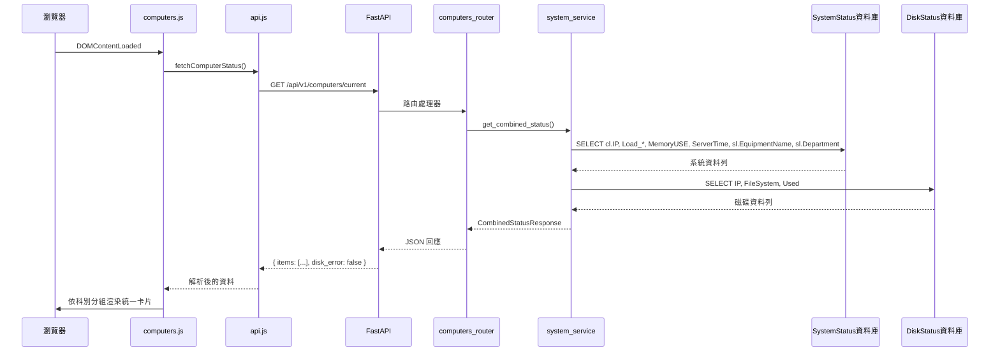

# 設計文件 — computer-status-unified-card

## 概述

目前「電腦即時狀況」頁面分別呼叫 `/api/v1/system/current` 與 `/api/v1/disk/current` 兩支 API，並渲染兩個獨立區塊。本功能將兩者合併為單一後端端點（`GET /api/v1/computers/current`），前端每台電腦只顯示一張統一卡片，同時呈現系統指標與所有磁碟資料。

變更涉及三個層次：

1. **服務層** — 在 `system_service.py` 新增 `get_combined_status()`，以 IP 為鍵合併系統與磁碟資料。
2. **路由層** — 新增 `backend/routers/computers.py`，並在 `main.py` 中註冊。
3. **前端** — `computers.html` 簡化為單一 `<section id="computers-container">`；`computers.js` 改寫為統一卡片渲染；`api.js` 新增 `fetchComputerStatus()`。

不需要變更資料庫結構；所有資料已存在於 SystemStatus 與 DiskStatus 資料庫中。

---

## 架構



---

## 元件與介面

### 後端

#### `get_combined_status()` — `backend/services/system_service.py`

```python
def get_combined_status() -> tuple[list[dict], bool]:
    """
    回傳 (items, disk_error)。
    items：每個唯一 IP 對應一筆資料，包含系統指標與磁碟清單。
    disk_error：若 DiskStatus 資料庫無法連線則為 True。
    若 SystemStatus 資料庫無法連線，則向上拋出 OperationalError（不在此捕捉）。
    """
```

回傳清單中每筆資料的結構：

```python
{
    "ip": str,
    "equipment_name": str,
    "department": str,
    "load_1": float | None,
    "load_5": float | None,
    "load_15": float | None,
    "memory_use": float | None,
    "server_time": str | None,   # 來自資料庫 ServerTime 欄位的 ISO-8601 字串
    "disks": [
        {"file_system": str, "used_pct": float | None},
        ...
    ]
}
```

#### `backend/routers/computers.py`

精簡路由，完全委派給服務層。

```python
router = APIRouter(tags=["computers"])

@router.get("/api/v1/computers/current", response_model=ComputerStatusResponse)
def current_computer_status():
    ...
```

當 `get_combined_status()` 因 SystemStatus 資料庫故障而拋出例外時，回傳 HTTP 503。

#### Pydantic 模型 — `backend/models.py`

```python
class DiskEntry(BaseModel):
    file_system: str
    used_pct: Optional[float]

class ComputerItem(BaseModel):
    ip: str
    equipment_name: str
    department: str
    load_1: Optional[float]
    load_5: Optional[float]
    load_15: Optional[float]
    memory_use: Optional[float]
    server_time: Optional[str]
    disks: list[DiskEntry]

class ComputerStatusResponse(BaseModel):
    items: list[ComputerItem]
    disk_error: bool
```

### 前端

#### `frontend/js/api.js` — 新增函式

```js
/** 取得每台電腦的合併系統與磁碟狀態 */
async function fetchComputerStatus() {
  return apiFetch('/computers/current');
}
```

#### `frontend/js/computers.js` — 改寫

主要公開函式：

| 函式 | 職責 |
|---|---|
| `_refreshData()` | 呼叫 `fetchComputerStatus()`，委派給 `_renderUnifiedGrid()` |
| `_renderUnifiedGrid(items, diskError)` | 依科別分組，渲染所有統一卡片 |
| `_renderUnifiedCard(item)` | 回傳單台電腦的 HTML 字串 |
| `_memLevel(pct)` | 回傳記憶體的警示等級 |
| `_diskLevel(usedPct)` | 回傳單一磁碟的警示等級 |
| `_cpuTimeoutLevel(serverTimeStr)` | 回傳 CPU 資料過期的警示等級 |
| `_worstLevel(...levels)` | 回傳最嚴重的等級 |

#### `frontend/computers.html` — 結構變更

將原本兩個 `<section>` 元素替換為：

```html
<section class="section">
  <h2>電腦即時狀況</h2>
  <div id="computers-container">
    <p class="loading">載入中…</p>
  </div>
</section>
```

---

## 資料模型

### SQL 查詢

**系統查詢**（沿用現有 `_SYSTEM_SQL`，新增 `ServerTime`）：

```sql
SELECT cl.IP, cl.Load_1, cl.Load_5, cl.LOAD_15, cl.MemoryUSE, cl.ServerTime,
       sl.EquipmentName, sl.Department
FROM CheckList cl
LEFT JOIN SystemIPList sl ON cl.IP = sl.IP
```

**磁碟查詢**（沿用現有 `_DISK_SQL`）：

```sql
SELECT IP, FileSystem, Used
FROM CheckList
```

### `get_combined_status()` 合併演算法

```
1. 查詢系統資料列 → 以 IP 為鍵建立有序字典
2. 查詢磁碟資料列 → 以 IP 為鍵分組成字典的清單
3. 對系統字典中的每個 IP：
     item["disks"] = disk_dict.get(ip, [])
4. 回傳 (list(system_dict.values()), disk_error)
```

系統查詢結果的順序會被保留（Python 3.7+ 的插入有序字典）。

### 警示燈號門檻（前端常數）

| 指標 | 黃色 | 橙色 | 紅色 |
|---|---|---|---|
| 記憶體（`memory_use`） | > 60% | > 70% | > 80% |
| 磁碟剩餘（`100 − used_pct`） | < 10% | < 5% | < 1% |
| CPU 逾時（距 `server_time` 的分鐘數） | > 3 分鐘 | > 10 分鐘 | > 30 分鐘 |

卡片邊框顏色 = `_worstLevel(memLevel, ...diskLevels, cpuLevel)`。

---

## 正確性屬性

*屬性是指在系統所有有效執行過程中都應成立的特性或行為——本質上是對系統應有行為的正式陳述。屬性是連接人類可讀規格與機器可驗證正確性保證的橋樑。*

### 屬性 1：每個唯一 IP 對應一筆資料

*對於任意* IP 分布的系統資料列清單，`get_combined_status()` 應回傳與唯一 IP 數量完全相同的資料筆數，且每筆資料應包含所有必要欄位（`ip`、`equipment_name`、`department`、`load_1`、`load_5`、`load_15`、`memory_use`、`server_time`、`disks`）。

**驗證：需求 1.2**

### 屬性 2：磁碟資料依 IP 正確分組

*對於任意* 系統資料列與磁碟資料列的組合，`get_combined_status()` 應將某 IP 的所有磁碟資料列放入該 IP 的 `disks` 陣列，且不得出現在其他 IP 下。當某 IP 沒有磁碟資料列時，`disks` 陣列應為空。

**驗證：需求 1.3、1.4**

### 屬性 3：記憶體警示等級與使用率單調遞增

*對於任意* 記憶體使用率百分比，`_memLevel()` 應在使用率 > 80 時回傳 `'red'`、70 < 使用率 ≤ 80 時回傳 `'orange'`、60 < 使用率 ≤ 70 時回傳 `'yellow'`，其餘回傳 `'ok'`。此對應關係應隨使用率增加而單調不遞減。

**驗證：需求 4.1、4.2、4.3**

### 屬性 4：磁碟警示等級與剩餘空間單調遞增

*對於任意* 磁碟 `used_pct`，`_diskLevel()` 應在剩餘空間 < 1% 時回傳 `'red'`、1% ≤ 剩餘 < 5% 時回傳 `'orange'`、5% ≤ 剩餘 < 10% 時回傳 `'yellow'`，其餘回傳 `'ok'`。此對應關係應隨剩餘空間減少而單調不遞減。

**驗證：需求 4.4、4.5、4.6**

### 屬性 5：CPU 逾時警示等級與過期時間單調遞增

*對於任意* `server_time` ISO 字串，`_cpuTimeoutLevel()` 應在經過時間 > 30 分鐘時回傳 `'red'`、10 < 經過 ≤ 30 分鐘時回傳 `'orange'`、3 < 經過 ≤ 10 分鐘時回傳 `'yellow'`，其餘回傳 `'ok'`。缺少或無法解析的 `server_time` 應回傳 `'red'`。

**驗證：需求 4.7、4.8、4.9**

### 屬性 6：最嚴重等級為最高嚴重度

*對於任意* 非空的警示等級集合，`_worstLevel()` 應回傳嚴重度排名最高的等級（`ok` < `yellow` < `orange` < `red`），且結果應大於或等於所有輸入等級。

**驗證：需求 4.10**

### 屬性 7：渲染的卡片包含所有必要資料

*對於任意* 欄位非空的電腦資料項目，`_renderUnifiedCard()` 產生的 HTML 字串應包含該項目的 `ip`、`equipment_name`、格式化的 `memory_use`（一位小數 + `%`）、格式化的 `load_1`、`load_5`、`load_15`（各兩位小數），以及每筆磁碟資料的 `file_system` 字串與格式化的 `used_pct`（一位小數 + `%`）。

**驗證：需求 2.2、2.3、2.4、2.5、2.6**

### 屬性 8：卡片數量等於電腦數量

*對於任意* 傳入 `_renderUnifiedGrid()` 的電腦資料清單，渲染後的 HTML 應包含與清單項目數量完全相同的 `instrument-card` class 元素。

**驗證：需求 2.1**

### 屬性 9：科別群組依指定順序排列

*對於任意* 科別分配任意的電腦資料清單，`_renderUnifiedGrid()` 渲染的群組標題應依 `wrs → mrs → sos → dqcs → rsa` 的順序排列，未知科別的群組附加在所有預定義群組之後。

**驗證：需求 3.1、3.2**

---

## 錯誤處理

| 故障情境 | 後端行為 | 前端行為 |
|---|---|---|
| SystemStatus 資料庫無法連線 | `get_combined_status()` 拋出例外；路由回傳 HTTP 503 | `apiFetch` 拋出 `{type: 'db_error'}`；狀態列顯示資料庫錯誤訊息；保留現有卡片 |
| DiskStatus 資料庫無法連線 | 回傳各電腦的 `disks: []` 並設 `disk_error: true` | 卡片渲染時無磁碟列；顯示磁碟資料不可用的提示橫幅 |
| 網路逾時（> 8 秒） | — | `apiFetch` 拋出 `{type: 'timeout'}`；狀態列顯示警告；保留現有卡片 |
| 指標值為 null | 服務回傳 `None`；序列化為 JSON `null` | `_renderUnifiedCard()` 對該指標顯示 `N/A` |
| 未知科別代碼 | — | 卡片放入「其他」群組，顯示在預定義群組之後 |

---

## 測試策略

### 單元測試（`tests/unit/`）

- 以模擬的 `get_session` 測試 `get_combined_status()` — 驗證合併邏輯、空磁碟清單、`disk_error` 旗標。
- 路由端點 — 驗證 HTTP 200 回應結構、SystemStatus 資料庫故障時的 HTTP 503、`disk_error` 傳遞。
- 警示等級函式（`_memLevel`、`_diskLevel`、`_cpuTimeoutLevel`、`_worstLevel`）— 各門檻的邊界值。

### 屬性測試（`tests/property/`）— Hypothesis，每個屬性最少 100 次迭代

每個屬性測試以下列格式標記：
```
# Feature: computer-status-unified-card, Property N: <屬性描述>
```

| 測試 | 屬性 | 函式庫 |
|---|---|---|
| `test_one_item_per_unique_ip` | 屬性 1 | hypothesis |
| `test_disk_grouping_by_ip` | 屬性 2 | hypothesis |
| `test_memory_level_monotone` | 屬性 3 | hypothesis |
| `test_disk_level_monotone` | 屬性 4 | hypothesis |
| `test_cpu_timeout_level_monotone` | 屬性 5 | hypothesis |
| `test_worst_level_is_maximum` | 屬性 6 | hypothesis |

屬性 7、8、9 涉及 DOM/HTML 渲染（純 JS），改以前端測試套件中的範例測試驗證，而非 Python 屬性測試。

### 整合測試（`tests/integration/`）

- 對真實（或測試夾具）資料庫呼叫 `GET /api/v1/computers/current` — 驗證回應結構與 HTTP 狀態碼。
- 驗證舊端點 `/api/v1/system/current` 與 `/api/v1/disk/current` 仍回傳 HTTP 200（向下相容）。

### 前端範例測試

- `computers.html` 包含且僅包含一個 `id="computers-container"` 的 `<section>`，且不含 `system-container` / `disk-container`。
- `computers.js` 不參照 `/system/current` 或 `/disk/current`。
- `_renderUnifiedCard()` 在欄位為 null 時渲染 `N/A`。
- 科別標籤對應正確的中文字串。
