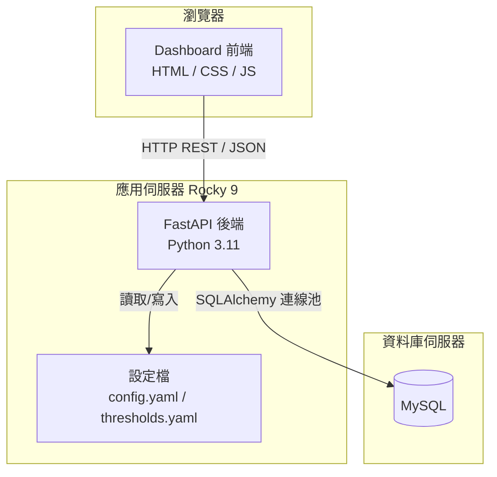

# 技術設計文件：雷達監控整合平台

## 概覽

雷達監控整合平台是一套前後端分離的網頁應用系統，部署於 Linux Rocky 9 環境。後端以 Python（FastAPI）提供 REST API，前端以純 HTML/CSS/JavaScript 實作 Dashboard，資料來源為 MySQL 資料庫。系統核心功能為即時顯示各儀器資料時間差（以顏色區分嚴重程度）與電腦系統狀態。資料異常的主動推播通知由外部系統負責，本平台僅負責視覺化呈現。

---

## 架構

### 整體架構圖



### 部署架構

- 作業系統：Linux Rocky 9
- Python 版本：3.11+
- 後端框架：FastAPI + Uvicorn（ASGI）
- 前端：靜態檔案，由 Nginx 或 FastAPI StaticFiles 提供服務
- 資料庫：MySQL 8.0+（外部既有資料庫，唯讀存取）
- 程序管理：systemd service

---

## 專案目錄結構

```
radar-monitoring-platform/
├── backend/
│   ├── main.py                  # FastAPI 應用程式進入點
│   ├── config.py                # 設定檔載入模組
│   ├── database.py              # SQLAlchemy 連線池管理
│   ├── models.py                # Pydantic 資料模型
│   ├── routers/
│   │   ├── completeness.py      # GET /api/v1/completeness/current
│   │   ├── instruments.py       # GET/PUT /api/v1/instruments/*
│   │   └── system.py            # GET /api/v1/system/current, /api/v1/disk/current
│   ├── services/
│   │   ├── alert_service.py     # 儀器時間差查詢與閾值管理
│   │   └── system_service.py    # 系統負載與磁碟狀態查詢
│   └── requirements.txt
├── frontend/
│   ├── index.html               # 首頁（導覽）
│   ├── instruments.html         # 儀器即時狀況
│   ├── computers.html           # 電腦即時狀況
│   ├── settings.html            # 儀器閾值設定
│   ├── css/
│   │   └── style.css
│   └── js/
│       ├── api.js               # 後端 API 呼叫封裝
│       ├── clock.js             # 共用時鐘
│       ├── dashboard.js         # 儀器即時狀況控制器
│       ├── computers.js         # 電腦即時狀況控制器
│       └── settings.js          # 閾值設定控制器
├── config/
│   ├── config.yaml              # 資料庫連線參數與系統設定
│   └── thresholds.yaml          # 各儀器閾值設定（持久化）
├── logs/
└── deploy/
    └── radar-monitor.service    # systemd 服務設定檔
```

---

## 元件與介面

### 後端元件

Backend 是前端與資料庫之間的橋樑，負責查詢並以 REST API 回傳結果。

- **資料存取層**：`database.py` 管理 SQLAlchemy 連線池，統一對三個 MySQL 資料庫（FileStatus、SystemStatus、DiskStatus）的唯讀存取。
- **業務邏輯層**：`services/` 封裝查詢邏輯，與路由層解耦。
- **API 層**：`routers/` 提供 `/api/v1` 前綴的 REST 端點，路由保持精簡。
- **設定層**：`config.py` 從 `config.yaml` 載入 DB 連線參數；閾值從 `thresholds.yaml` 讀寫。

#### alert_service.py

查詢所有 FileCheck 資料表，計算各儀器的 `diff_time_minutes`，並與 `thresholds.yaml` 的閾值比較。

```python
def get_all_instrument_statuses() -> list[InstrumentStatus]
def get_instrument_thresholds(file_type: str) -> tuple[float, float, float]
def set_instrument_thresholds(file_type: str, yellow: float, orange: float, red: float) -> None
def list_instruments() -> list[dict]
```

#### system_service.py

查詢 SystemStatus 和 DiskStatus 資料庫，回傳各電腦的負載、記憶體與磁碟使用率。

```python
def get_system_status() -> list[dict]
def get_disk_status() -> list[dict]
```

### 前端元件

| 頁面 | 檔案 | 說明 |
|------|------|------|
| 首頁 | `index.html` + `clock.js` | 導覽頁，三個入口 |
| 儀器即時狀況 | `instruments.html` + `dashboard.js` | 依科別分組，異常儀器直接顯示，正常儀器折疊為綠色摘要方框，點擊展開；頁面頂部有科別篩選列 |
| 電腦即時狀況 | `computers.html` + `computers.js` | 依科別分組，負載/記憶體/磁碟 |
| 儀器閾值設定 | `settings.html` + `settings.js` | 三段閾值設定，寫回 thresholds.yaml |

---

## API 設計

### 基礎路徑：`/api/v1`

#### GET `/api/v1/completeness/current`

取得所有儀器的即時狀態。

**回應（200 OK）：**
```json
{
  "instruments": [
    {
      "file_type": "RCMD_rb5_CS",
      "equipment_name": "radar",
      "ip": "192.168.1.10",
      "department": "wrs",
      "latest_file_time": "2026-04-02T10:00:00Z",
      "diff_time_minutes": 5.2,
      "threshold_yellow": 10.0,
      "threshold_orange": 15.0,
      "threshold_red": 20.0,
      "is_alert": false
    }
  ],
  "calculated_at": "2026-04-02T10:00:05Z",
  "status": "ok"
}
```

**回應（503）：** DB 連線失敗。

---

#### GET `/api/v1/instruments`

取得所有儀器清單與目前閾值。

#### PUT `/api/v1/instruments/{file_type}/threshold`

更新特定儀器的三段閾值。

**請求本體：**
```json
{
  "threshold_yellow": 10.0,
  "threshold_orange": 15.0,
  "threshold_red": 20.0
}
```

---

#### GET `/api/v1/system/current`

取得各電腦的系統負載與記憶體使用率。

#### GET `/api/v1/disk/current`

取得各電腦的磁碟使用率（%）。

---

## 資料模型

### 現有資料庫結構（唯讀存取）

**FileStatus 資料庫**
```sql
-- 各儀器類型的即時快照（最新一筆）
radarFileCheck        (IP, FileName, FileType, FileTime float, DiffTime float)
HFradarFileCheck      (IP, FileName, FileType, FileTime float, DiffTime float)
satelliteFileCheck    (IP, FileName, FileType, FileTime float, DiffTime float)
windprofilerFileCheck (IP, FileName, FileType, FileTime float, DiffTime float)
DSFileCheck           (IP, FileName, FileType, FileTime float, DiffTime float)
-- DS 前綴代表東沙島資料，FileType 以 DS_ 開頭

-- 各儀器類型的歷史記錄
radarStatus / HFradarStatus / satelliteStatus / windprofilerStatus / DSStatus
-- (ID, IP, FileName, FileType, FileTime float, DiffTime float)

-- 檔案類型對應設備名稱
FileTypeList (ID, FileType, EquipmentName)
```

**SystemStatus 資料庫**
```sql
CheckList   (IP PK, ServerTime datetime, Load_1, Load_5, LOAD_15, MemoryUSE float)
SystemIPList (IP PK, EquipmentName, Department)
```

> **Department 代碼對照表**
>
> | Department | 中文名稱 |
> |-----------|---------|
> | `sos`  | 衛星作業科 |
> | `dqcs` | 品管科 |
> | `rsa`  | 應用科 |
> | `wrs`  | 氣象雷達科 |
> | `mrs`  | 海象雷達科 |

**DiskStatus 資料庫**
```sql
CheckList (IP, ServerTime datetime, FileSystem, Used float)
-- Used: 磁碟使用率（%）
```

### 閾值設定（thresholds.yaml）

操作人員只需設定每個儀器的資料週期 $T$（分鐘），系統自動計算三段門檻：
- 黃色 = $T$ + 5 分鐘
- 橙色 = $T$ + 10 分鐘
- 紅色 = $T$ + 20 分鐘

```yaml
defaults:
  interval_minutes: 7  # 預設資料週期 T（分鐘）

instruments:
  RCMD_rb5_CS:
    interval_minutes: 10  # 此儀器的資料週期 T
  RCKT_rb5_CDD:
    interval_minutes: 7
```

啟動時從檔案載入，透過 API 修改後立即寫回，重啟後保留。

### 儀器狀態顏色規則

以資料週期 $T$ 為基準，系統自動計算三段門檻：

| 條件 | 顏色 | 狀態 |
|------|------|------|
| diff ≤ $T$ + 5 分鐘 | 🟢 綠色 | 正常（Normal） |
| diff > $T$ + 5 分鐘 | 🟡 黃色 | 延遲（Delayed） |
| diff > $T$ + 10 分鐘 | 🟠 橙色 | 嚴重延遲（Critical Delay） |
| diff > $T$ + 20 分鐘 | 🔴 紅色 | 遺失（Missing） |
| diff > 14400 分鐘或 NULL | ⬜ 灰色 | 斷線 |

各科別分組顯示邏輯：
- **正常儀器**：不單獨顯示，以一個綠色摘要方框呈現「共 N 台，正常 M 台」，點擊後展開顯示各別正常儀器卡片。
- **異常儀器**（黃/橙/紅/灰）：直接顯示在分組內，不需點擊展開。

科別篩選列：
- 儀器狀態頁面頂部顯示一排圓角篩選按鈕：**全部 / 氣象雷達科 / 海象雷達科 / 衛星作業科 / 品管科 / 應用科**
- 點擊科別按鈕後，僅顯示該科別的分組，其餘隱藏；點擊「全部」恢復顯示所有分組
- 篩選為純前端操作，不重新打 API，直接從已快取資料重新渲染
- 自動刷新後保持目前選取的篩選狀態

### Pydantic 模型

```python
class InstrumentStatus(BaseModel):
    file_type: str
    equipment_name: str
    ip: Optional[str]
    department: Optional[str]
    latest_file_time: Optional[datetime]
    diff_time_minutes: Optional[float]
    interval_minutes: float   # 資料週期 T
    threshold_yellow: float   # T + 5（自動計算）
    threshold_orange: float   # T + 10（自動計算）
    threshold_red: float      # T + 20（自動計算）
    is_alert: bool

class InstrumentIntervalSetting(BaseModel):
    interval_minutes: float = Field(gt=0.0)  # 資料週期 T，必須大於 0
```

#### 電腦狀態三段燈號

| 指標 | 黃燈 | 橙燈 | 紅燈 |
|------|------|------|------|
| CPU 使用率 | 連續 1 分鐘 > 80% | 連續 5 分鐘 > 80% | 連續 15 分鐘 > 80% |
| CPU 更新逾時 | > 3 分鐘未更新 | > 10 分鐘未更新 | > 30 分鐘未更新 |
| 記憶體負載 | > 60% | > 70% | > 80% |
| 磁碟剩餘空間 | < 10% | < 5% | < 1% |

| 錯誤類型 | 後端行為 | 前端顯示 |
|----------|----------|----------|
| DB 連線失敗 | 回傳 503 | 顯示「資料庫連線失敗」 |
| 查詢逾時（>5秒） | 回傳 504，記錄日誌 | 顯示「資料更新失敗，正在重試」 |
| 網路錯誤 | N/A | 顯示「資料更新失敗，正在重試」 |
| 閾值輸入負數 | 回傳 422 | 顯示驗證錯誤訊息 |
| 儀器不存在 | 回傳 404 | 顯示「找不到指定儀器」 |
| 3 次重連失敗 | 記錄 ERROR 日誌 | 顯示持續性連線失敗警示 |

---

## 測試策略

- 單元測試：`pytest` + `pytest-mock`，測試 DB 連線重試邏輯、閾值驗證
- 整合測試：`pytest` + `httpx`，測試 API 端點正常回應與錯誤情境
- 屬性測試：`hypothesis`，驗證閾值判斷邏輯的正確性

---

## 異常判定標準與告警機制

### 檔案到位判定標準

以資料週期結束時間 $T$ 為基準：

| 狀態 | 條件 | 說明 |
|------|------|------|
| 正常（Normal） | diff ≤ $T$ + 5 分鐘 | 檔案於週期結束後 5 分鐘內抵達 |
| 延遲（Delayed） | $T$ + 5 < diff ≤ $T$ + 10 分鐘 | 檔案超過 5 分鐘未抵達 |
| 嚴重延遲（Critical Delay） | $T$ + 10 < diff ≤ $T$ + 20 分鐘 | 檔案超過 10 分鐘未抵達 |
| 遺失（Missing） | diff > $T$ + 20 分鐘 | 檔案超過 20 分鐘未抵達 |

### 硬體警戒門檻

| 指標 | 警告條件 |
|------|---------|
| CPU 使用率 | 超過 80% |
| 記憶體負載 | 超過 60% |
| 磁碟空間 | 剩餘空間低於 10% |
| CPU 更新逾時 | 超過 3 分鐘未更新（表示電腦關機或網路不通） |

### 異常分級與燈號

依影響程度分為三個等級：

#### 🟡 黃燈（Warning）
- 檔案延遲（Delayed）
- CPU 使用率連續 **1 分鐘**超過 80%
- 記憶體負載超過 60%
- 磁碟剩餘空間低於 10%
- CPU 使用率超過 **3 分鐘**未更新

#### 🟠 橙燈（Critical）
- 檔案嚴重延遲（Critical Delay）
- CPU 使用率連續 **5 分鐘**超過 80%
- 記憶體負載超過 70%
- 磁碟剩餘空間低於 5%
- CPU 使用率超過 **10 分鐘**未更新

#### 🔴 紅燈（Emergency）
- 檔案遺失（Missing）
- CPU 使用率連續 **15 分鐘**超過 80%
- 記憶體負載超過 80%
- 磁碟剩餘空間低於 1%
- CPU 使用率超過 **30 分鐘**未更新

#### 電腦狀態三段燈號

| 指標 | 黃燈 | 橙燈 | 紅燈 |
|------|------|------|------|
| CPU 使用率 | 連續 1 分鐘 > 80% | 連續 5 分鐘 > 80% | 連續 15 分鐘 > 80% |
| CPU 更新逾時 | > 3 分鐘未更新 | > 10 分鐘未更新 | > 30 分鐘未更新 |
| 記憶體負載 | > 60% | > 70% | > 80% |
| 磁碟剩餘空間 | < 10% | < 5% | < 1% |
