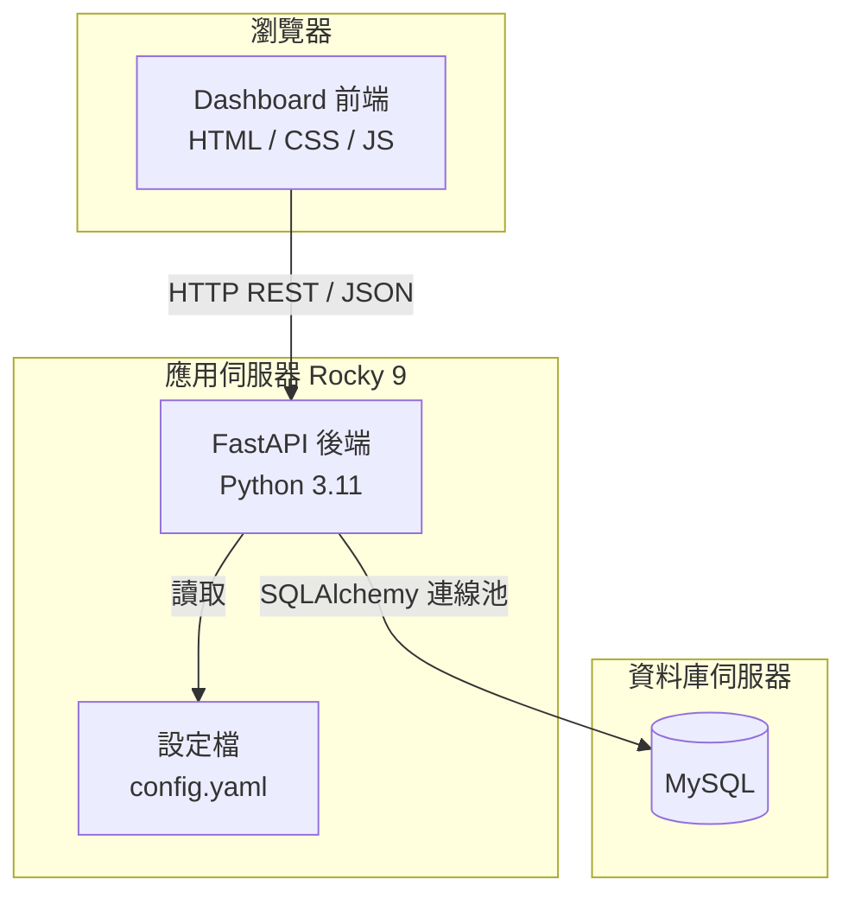

# 技術設計文件：雷達監控整合平台

## 概覽

雷達監控整合平台是一套前後端分離的網頁應用系統，部署於 Linux Rocky 9 環境。後端以 Python（FastAPI）提供 REST API，前端以純 HTML/CSS/JavaScript 實作 Dashboard，資料來源為 MySQL 資料庫。系統核心功能為即時顯示雷達資料完整率、時間序列趨勢圖，以及在資料異常時主動發出視覺警示。

---

## 架構

### 整體架構圖



### 部署架構

- 作業系統：Linux Rocky 9
- Python 版本：3.11+
- 後端框架：FastAPI + Uvicorn（ASGI）
- 前端：靜態檔案，由 Nginx 或 FastAPI StaticFiles 提供服務
- 資料庫：MySQL 8.0+（外部既有資料庫，唯讀存取）
- 程序管理：systemd service

---

## 專案目錄結構

```
radar-monitoring-platform/
├── backend/
│   ├── main.py                  # FastAPI 應用程式進入點
│   ├── config.py                # 設定檔載入模組
│   ├── database.py              # SQLAlchemy 連線池管理
│   ├── routers/
│   │   ├── __init__.py
│   │   ├── completeness.py      # 資料完整率 API
│   │   ├── instruments.py       # 儀器清單與閾值設定 API
│   │   └── settings.py          # 系統設定 API
│   ├── services/
│   │   ├── __init__.py
│   │   ├── completeness_service.py  # 資料完整率計算邏輯
│   │   └── alert_service.py         # 儀器時間差警示判斷邏輯
│   └── requirements.txt
├── frontend/
│   ├── index.html               # Dashboard 主頁面
│   ├── css/
│   │   └── style.css
│   └── js/
│       ├── dashboard.js         # 主控制器（刷新、時間顯示）
│       ├── chart.js             # 時間序列圖（Chart.js）
│       └── api.js               # 後端 API 呼叫封裝
├── config/
│   └── config.yaml              # 資料庫連線參數與系統設定
├── logs/                        # 應用程式日誌目錄
└── deploy/
    └── radar-monitor.service    # systemd 服務設定檔
```

---

## 元件與介面

### 後端元件

Backend 是前端與資料庫之間的橋樑，負責查詢、計算，並以 REST API 的形式將結果回傳給儀表板。其職責分為四層：

- **資料存取層**：`database.py` 管理 SQLAlchemy 連線池，統一對三個 MySQL 資料庫（FileStatus、SystemStatus、DiskStatus）的唯讀存取；`config.py` 從 `config/config.yaml` 載入所有設定，確保 DB 連線參數不會寫死在程式碼裡。
- **業務邏輯層**：`services/` 封裝核心計算邏輯（完整率計算、警示判斷），與路由層解耦。
- **API 層**：`routers/` 提供 `/api/v1` 前綴的 REST 端點，路由保持精簡，僅負責輸入驗證並委派給 services。
- **框架**：FastAPI + Uvicorn（ASGI），前端透過 `fetch` API 呼叫端點，不直接存取資料庫。

#### 1. 設定管理（config.py）

負責從 `config/config.yaml` 載入所有設定，包含資料庫連線參數與系統預設值。設定值不得硬編碼於程式碼中。

```python
# config.yaml 結構範例
database:
  host: "localhost"
  port: 3306
  name: "radar_db"
  user: "radar_user"
  password: "secret"
  pool_size: 5
  pool_timeout: 30

system:
  default_max_diff_time_threshold: 30.0
  query_timeout_seconds: 5
  reconnect_interval_seconds: 10
  max_reconnect_attempts: 3
```

#### 2. 資料庫連線池（database.py）

使用 SQLAlchemy 建立連線池，支援並發查詢。連線中斷時自動重試，最多 3 次，間隔 10 秒。

```python
# 核心介面
def get_engine() -> Engine
def get_session() -> Session
def check_connection() -> bool
```

#### 3. 資料完整率服務（completeness_service.py）

封裝資料完整率的計算邏輯，與資料庫查詢解耦。

```python
# 核心介面
def calculate_completeness(start_time: datetime, end_time: datetime) -> float
def get_time_series(start_time: datetime, end_time: datetime) -> list[dict]
```

#### 3. 警示服務（alert_service.py）

封裝儀器時間差警示的判斷邏輯，查詢 `radarFileCheck` 取得每個儀器最新一筆快照，計算 DiffTime 並與各儀器的 Max_DiffTime_Threshold 比較。

```python
# 核心介面
def get_all_instrument_statuses() -> list[InstrumentStatus]
def get_instrument_threshold(file_type: str) -> float
def set_instrument_threshold(file_type: str, threshold_minutes: float) -> None
```

#### 4. API 路由

- `routers/completeness.py`：提供資料完整率查詢端點
- `routers/instruments.py`：提供儀器清單查詢與各儀器閾值讀寫端點
- `routers/settings.py`：提供系統層級設定端點

### 前端元件

Frontend 是操作人員直接面對的儀表板介面，以純 HTML/CSS/JavaScript 實作，不依賴任何前端框架。其職責依關注點分離為三個 JS 模組：

- **api.js**：封裝所有對後端的 `fetch` 呼叫，統一處理 HTTP 錯誤、逾時與網路失敗，其他模組不直接發出 HTTP 請求。
- **chart.js**：負責使用 Chart.js 繪製時間序列折線圖，標示異常資料點，不處理資料取得邏輯。
- **dashboard.js**：主控制器，負責每秒更新本地時間與 UTC 時間、每 10 秒觸發自動刷新、顯示各儀器警示狀態區塊（依科別分組），並協調 api.js。
- **computers.js**：電腦即時狀況頁面控制器，顯示系統負載、記憶體與磁碟使用率（依科別分組）。

靜態檔案由 Nginx 或 FastAPI `StaticFiles` 提供服務，瀏覽器透過 REST API 與後端溝通，不直接存取資料庫。

#### 頁面結構

| 頁面 | 檔案 | 說明 |
|------|------|------|
| 首頁 | `index.html` | 導覽頁，提供三個入口：儀器即時狀況、電腦即時狀況、儀器閾值設定 |
| 儀器即時狀況 | `instruments.html` | 顯示各儀器警示狀態，依 Department 分組，移除資料完整率趨勢圖 |
| 電腦即時狀況 | `computers.html` | 顯示系統負載/記憶體與磁碟使用率（%），依 Department 分組 |
| 儀器閾值設定 | `settings.html` | 獨立頁面，管理各儀器的 Max_DiffTime_Threshold |

#### 分組規則

儀器警示狀態、系統負載、磁碟使用率均依 `SystemIPList.Department` 欄位分組顯示：

| Department | 顯示名稱 |
|-----------|---------|
| `sos`  | 衛星作業科 |
| `dqcs` | 品管科 |
| `rsa`  | 應用科 |
| `wrs`  | 氣象雷達科 |
| `mrs`  | 海象雷達科 |

儀器警示狀態的分組：透過 `radarFileCheck.IP` → `SystemIPList.Department` 取得科別。
電腦狀態的分組：透過 `CheckList.IP` → `SystemIPList.Department` 取得科別。

| 元件 | 檔案 | 職責 |
|------|------|------|
| 時間顯示器 | clock.js | 每秒更新本地時間與 UTC 時間（所有頁面共用） |
| 自動刷新控制器 | dashboard.js / computers.js | 每 10 秒觸發資料更新，管理計時器 |
| 儀器警示狀態顯示 | dashboard.js | 依科別分組顯示各儀器警示區塊與 DiffTime |
| 系統負載/記憶體顯示 | computers.js | 依科別分組顯示各電腦負載與記憶體使用率 |
| 磁碟使用率顯示 | computers.js | 依科別分組顯示各電腦磁碟使用率（%） |
| 儀器閾值設定 | settings.js | 獨立頁面，管理各儀器閾值 |
| API 客戶端 | api.js | 封裝所有 fetch 呼叫，統一錯誤處理 |

---

## API 設計

### 基礎路徑：`/api/v1`

#### GET `/api/v1/completeness/current`

取得所有儀器的當前即時警示狀態（基於 `radarFileCheck` 最新快照）。

**回應（200 OK）：**
```json
{
  "instruments": [
    {
      "file_type": "RADAR_A",
      "equipment_name": "雷達站 A",
      "latest_file_time": "2024-01-15T10:28:00Z",
      "diff_time_minutes": 2.5,
      "max_diff_time_threshold": 30.0,
      "is_alert": false
    },
    {
      "file_type": "RADAR_B",
      "equipment_name": "雷達站 B",
      "latest_file_time": "2024-01-15T09:45:00Z",
      "diff_time_minutes": 45.2,
      "max_diff_time_threshold": 30.0,
      "is_alert": true
    }
  ],
  "calculated_at": "2024-01-15T10:30:00Z",
  "status": "ok"
}
```

**回應（503 Service Unavailable）：**
```json
{
  "status": "db_error",
  "message": "資料庫連線失敗",
  "last_known_at": "2024-01-15T10:29:50Z"
}
```

---

#### GET `/api/v1/completeness/timeseries`

取得時間序列資料，用於折線圖。

**查詢參數：**
| 參數 | 型別 | 預設值 | 說明 |
|------|------|--------|------|
| `start` | ISO 8601 datetime | 當前時間 - 24h | 查詢起始時間 |
| `end` | ISO 8601 datetime | 當前時間 | 查詢結束時間 |

**回應（200 OK）：**
```json
{
  "data": [
    {
      "timestamp": "2024-01-15T09:00:00Z",
      "completeness_rate": 99.1,
      "is_alert": false
    },
    {
      "timestamp": "2024-01-15T09:10:00Z",
      "completeness_rate": 93.2,
      "is_alert": true
    }
  ],
  "start": "2024-01-14T10:30:00Z",
  "end": "2024-01-15T10:30:00Z"
}
```

---

#### GET `/api/v1/instruments`

取得所有儀器清單及其目前的 Max_DiffTime_Threshold 設定。

**回應（200 OK）：**
```json
{
  "instruments": [
    {
      "file_type": "RADAR_A",
      "equipment_name": "雷達站 A",
      "max_diff_time_threshold": 30.0
    },
    {
      "file_type": "RADAR_B",
      "equipment_name": "雷達站 B",
      "max_diff_time_threshold": 60.0
    }
  ]
}
```

---

#### PUT `/api/v1/instruments/{file_type}/threshold`

更新特定儀器的 Max_DiffTime_Threshold。

**請求本體：**
```json
{
  "max_diff_time_threshold": 45.0
}
```

**回應（200 OK）：**
```json
{
  "file_type": "RADAR_A",
  "max_diff_time_threshold": 45.0,
  "updated_at": "2024-01-15T10:30:00Z"
}
```

**回應（422 Unprocessable Entity）：**
當 max_diff_time_threshold 為負數時回傳。

**回應（404 Not Found）：**
當指定的 file_type 不存在於 FileTypeList 時回傳。

---

## 資料模型

### 現有資料庫結構（唯讀存取）

系統連接三個現有 MySQL 資料庫，僅進行唯讀查詢，不建立或修改任何資料表。

**FileStatus 資料庫（雷達資料）**
```sql
-- 各儀器類型的即時快照資料表（最新一筆狀態）
radarFileCheck        (IP, FileName, FileType, FileTime float, DiffTime float)
HFradarFileCheck      (IP, FileName, FileType, FileTime float, DiffTime float)
satelliteFileCheck    (IP, FileName, FileType, FileTime float, DiffTime float)
windprofilerFileCheck (IP, FileName, FileType, FileTime float, DiffTime float)
DSFileCheck           (IP, FileName, FileType, FileTime float, DiffTime float)
-- DS 前綴代表東沙島資料，FileType 以 DS_ 開頭

-- 各儀器類型的歷史記錄資料表
radarStatus        (ID, IP, FileName, FileType, FileTime float, DiffTime float)
HFradarStatus      (ID, IP, FileName, FileType, FileTime float, DiffTime float)
satelliteStatus    (ID, IP, FileName, FileType, FileTime float, DiffTime float)
windprofilerStatus (ID, IP, FileName, FileType, FileTime float, DiffTime float)
DSStatus           (ID, IP, FileName, FileType, FileTime float, DiffTime float)
-- FileTime: Unix timestamp（秒），表示資料時間
-- DiffTime: 檔案延遲時間（秒）

-- 檔案類型對應設備名稱
FileTypeList (ID, FileType, EquipmentName)
```

> **資料表命名規則**
>
> | 前綴 | 儀器類型 | 備註 |
> |------|---------|------|
> | `radar` | 氣象雷達 | FileType 以 RC 開頭 |
> | `HFradar` | 海象雷達（HF Radar） | |
> | `satellite` | 衛星 | |
> | `windprofiler` | 風廓線儀（Wind Profiler） | |
> | `DS` | 東沙島儀器 | FileType 以 `DS_` 開頭 |
>
> 儀器警示狀態目前查詢 `radarFileCheck`，其他儀器類型的 FileCheck 資料表結構相同，可依需求擴充。

**SystemStatus 資料庫（電腦系統狀態）**
```sql
-- 系統負載與記憶體歷史記錄
Status (IP, ServerTime datetime, Load_1, Load_5, LOAD_15, MemoryUSE float)

-- 最新一筆系統狀態
CheckList (IP PK, ServerTime datetime, Load_1, Load_5, LOAD_15, MemoryUSE float)

-- IP 對應設備名稱與部門
SystemIPList (IP PK, EquipmentName, Department)
```

> **Department 代碼對照表**
>
> | Department 值 | 中文名稱 |
> |--------------|---------|
> | `sos`  | 衛星作業科 |
> | `dqcs` | 品管科 |
> | `rsa`  | 應用科 |
> | `wrs`  | 氣象雷達科 |
> | `mrs`  | 海象雷達科 |
>
> 儀器警示狀態頁面與電腦即時狀況頁面均依此 Department 欄位分組顯示。
> `FileTypeList.EquipmentName` 與 `SystemIPList.EquipmentName` 的值對應同一台電腦所收的儀器類型，可透過 IP 欄位跨資料庫關聯取得 Department。

**DiskStatus 資料庫（磁碟狀態）**
```sql
-- 磁碟使用率歷史記錄
Status (IP, ServerTime datetime, FileSystem, Used float)

-- 最新一筆磁碟狀態
CheckList (IP, ServerTime datetime, FileSystem, Used float)
```

### 資料完整率計算邏輯

雷達資料頻率約每 7~10 分鐘一筆，以 10 分鐘為預期間隔計算 expected_count。

```sql
-- 計算指定時間區間的資料完整率（依 FileType 分組）
-- expected_count = 區間分鐘數 / 10（每 10 分鐘一筆）
-- actual_count   = 實際接收到的筆數

SELECT
    FileType,
    COUNT(*) AS actual_count,
    FLOOR(TIMESTAMPDIFF(MINUTE, :start_time, :end_time) / 10) AS expected_count,
    ROUND(
        COUNT(*) * 100.0 / NULLIF(
            FLOOR(TIMESTAMPDIFF(MINUTE, :start_time, :end_time) / 10), 0
        ),
        2
    ) AS completeness_rate
FROM FileStatus.radarStatus
WHERE FROM_UNIXTIME(FileTime) BETWEEN :start_time AND :end_time
GROUP BY FileType;
```

### 時間序列查詢（每小時聚合）

```sql
-- 以小時為單位聚合，用於折線圖（全部 FileType 合計）
SELECT
    FROM_UNIXTIME(FileTime, '%Y-%m-%d %H:00:00') AS hour_bucket,
    COUNT(*) AS actual_count,
    FLOOR(60 / 10) AS expected_per_hour,   -- 每小時預期 6 筆
    ROUND(COUNT(*) * 100.0 / NULLIF(FLOOR(60 / 10), 0), 2) AS completeness_rate
FROM FileStatus.radarStatus
WHERE FROM_UNIXTIME(FileTime) BETWEEN :start_time AND :end_time
GROUP BY hour_bucket
ORDER BY hour_bucket ASC;
```

### config.yaml 多資料庫設定

```yaml
databases:
  file_status:
    host: "localhost"
    port: 3306
    name: "FileStatus"
    user: "monitor_user"
    password: "secret"
    pool_size: 5
  system_status:
    host: "localhost"
    port: 3306
    name: "SystemStatus"
    user: "monitor_user"
    password: "secret"
    pool_size: 3
  disk_status:
    host: "localhost"
    port: 3306
    name: "DiskStatus"
    user: "monitor_user"
    password: "secret"
    pool_size: 3

system:
  radar_interval_minutes: 10      # 雷達資料預期間隔（分鐘）
  query_timeout_seconds: 5
  reconnect_interval_seconds: 10
  max_reconnect_attempts: 3
  default_max_diff_time_threshold: 30.0  # 儀器預設最大時間差閾值（分鐘）

# 各儀器的 Max_DiffTime_Threshold 初始預設值（分鐘）
# 若應用程式狀態中已有設定，以應用程式狀態為準
instruments:
  RADAR_A:
    max_diff_time_threshold: 30.0
  RADAR_B:
    max_diff_time_threshold: 30.0
```

> **閾值儲存策略**：`Max_DiffTime_Threshold` 以 `config.yaml` 的 `instruments` 區段作為初始預設值，運行期間由操作人員透過 API 修改的設定值儲存於應用程式記憶體狀態（`alert_service.py` 內的 dict）。服務重啟後回復為 config.yaml 的預設值。若需持久化，可於後續版本改為寫回 config.yaml 或另建設定資料表。

### 應用程式內部資料模型

```python
# Pydantic 模型（後端）
class CompletenessResult(BaseModel):
    completeness_rate: float        # 0.0 ~ 100.0
    calculated_at: datetime
    status: Literal["ok", "no_data", "db_error"]

class TimeSeriesPoint(BaseModel):
    timestamp: datetime
    completeness_rate: float
    is_alert: bool

class InstrumentStatus(BaseModel):
    file_type: str
    equipment_name: str
    latest_file_time: datetime | None
    diff_time_minutes: float | None  # NOW() - FROM_UNIXTIME(FileTime)，單位：分鐘，應為非負數
    max_diff_time_threshold: float   # 單位：分鐘，ge=0
    is_alert: bool                   # diff_time_minutes > max_diff_time_threshold

class InstrumentThresholdSetting(BaseModel):
    max_diff_time_threshold: float = Field(ge=0.0)  # 單位：分鐘，不得為負數
```

---

## 正確性屬性

*屬性（Property）是在系統所有合法執行情境下都應成立的特性或行為，本質上是對系統應做什麼的形式化陳述。屬性作為人類可讀規格與機器可驗證正確性保證之間的橋樑。*

### 屬性 1：時間格式化正確性

*對任意* 有效的 datetime 物件，時間格式化函式的輸出字串應符合 `YYYY-MM-DD HH:mm:ss` 格式，且本地時間與 UTC 時間應為不同值（除非系統時區為 UTC）。

**驗證需求：1.3、1.4**

---

### 屬性 2：資料完整率數值範圍

*對任意* 實際接收筆數與預期筆數的組合，計算出的 Data_Completeness_Rate 應始終落在 0.0% 至 100.0% 的範圍內，且格式化後的字串應符合百分比格式（例如 `98.5%`）。

**驗證需求：2.1**

---

### 屬性 3：查詢結果處理一致性

*對任意* 資料庫查詢結果（成功、空結果、連線失敗），系統回應的 `status` 欄位應與實際查詢狀態一致：成功時為 `ok`，空結果時為 `no_data`，連線失敗時為 `db_error`，且連線失敗時應保留上一次成功的數值。

**驗證需求：2.2、2.3、2.4**

---

### 屬性 4：警示觸發邏輯一致性

*對任意* Instrument 的 diff_time_minutes 數值與其 max_diff_time_threshold 設定值，該 Instrument 的 is_alert 狀態應與 `diff_time_minutes > max_diff_time_threshold` 的布林結果完全一致：當時間差超過閾值時警示應顯示，否則應隱藏。每個 Instrument 的警示狀態應獨立計算，互不影響。

**驗證需求：3.1、3.2、3.3**

---

### 屬性 5：警示物件完整性

*對任意* 觸發警示的 Instrument 事件，產生的 Missing_Data_Alert 物件應包含 Instrument 名稱（`file_type`）、觸發時間戳記（`triggered_at`）與當時的實際 DiffTime 數值（`diff_time_minutes`），三個欄位均不得為空。

**驗證需求：3.4**

---

### 屬性 6：儀器閾值設定驗證

*對任意* 輸入值，每個 Instrument 的 Max_DiffTime_Threshold 設定介面應拒絕所有負數輸入，並對任意非負數值（ge=0）正確儲存與回傳。不同 Instrument 的閾值設定應互相獨立，修改一個 Instrument 的閾值不得影響其他 Instrument 的閾值。

**驗證需求：7.3、7.4、7.5**

---

### 屬性 7：時間序列查詢邊界

*對任意* 自訂時間區間 `[start, end]`，時間序列查詢回傳的所有資料點的時間戳記應落在 `[start, end]` 區間內，不得包含區間外的資料點。

**驗證需求：4.3**

---

### 屬性 8：刷新後時間戳記更新

*對任意* 成功的資料刷新操作，`last_refreshed_at` 時間戳記應更新為不早於刷新前的時間戳記（單調遞增）。

**驗證需求：5.3**

---

### 屬性 9：網路錯誤重試行為

*對任意* 刷新週期中發生的網路錯誤，系統應在下一個 Refresh_Interval 重新嘗試，且錯誤提示應在錯誤發生後立即顯示，不得靜默失敗。

**驗證需求：5.4**

---

### 屬性 10：資料庫重連重試上限

*對任意* 資料庫連線中斷事件，系統的重試次數應不超過 3 次，且每次重試間隔應不少於 10 秒。當 3 次重試均失敗後，系統應停止重試並記錄錯誤日誌。

**驗證需求：6.4、6.5**

---

### 屬性 11：儀器時間差計算正確性

*對任意* `radarFileCheck` 快照中的 FileTime 值，計算出的 `diff_time_minutes`（`NOW() - FROM_UNIXTIME(FileTime)` 換算為分鐘）應為非負數。若 FileTime 為 NULL 或無法取得，`diff_time_minutes` 應為 NULL，且 `is_alert` 應為 `true`（視為資料缺失）。

**驗證需求：3.5、3.6**

---

## 錯誤處理

### 錯誤分類與處理策略

| 錯誤類型 | 觸發條件 | 後端行為 | 前端顯示 |
|----------|----------|----------|----------|
| 資料庫連線失敗 | 無法建立連線 | 回傳 503，附帶上次成功數值 | 顯示「資料庫連線失敗」，保留舊數值 |
| 查詢逾時 | 查詢超過 5 秒 | 回傳 504，記錄日誌 | 顯示「資料更新失敗，正在重試」 |
| 空查詢結果 | 查詢回傳 0 筆 | 回傳 204 | 顯示「目前無資料」 |
| 網路錯誤 | fetch 失敗 | N/A | 顯示「資料更新失敗，正在重試」 |
| 閾值輸入無效 | max_diff_time_threshold 為負數 | 回傳 422 | 顯示欄位驗證錯誤訊息 |
| 儀器不存在 | file_type 不在 FileTypeList | 回傳 404 | 顯示「找不到指定儀器」 |
| 連續重連失敗 | 3 次重連均失敗 | 記錄 ERROR 日誌 | 顯示持續性連線失敗警示 |

### 日誌策略

- 使用 Python `logging` 模組，輸出至 `logs/app.log`
- 日誌等級：INFO（一般操作）、WARNING（可恢復錯誤）、ERROR（需人工介入）
- 日誌格式：`%(asctime)s [%(levelname)s] %(name)s: %(message)s`

---

## 測試策略

### 雙軌測試方法

本系統採用單元測試與屬性測試並行的策略，兩者互補以達到全面覆蓋。

- **單元測試**：驗證特定範例、邊界情況與錯誤條件
- **屬性測試**：驗證對所有合法輸入均成立的通用屬性

### 屬性測試設定

- 屬性測試函式庫：**Hypothesis**（Python）
- 每個屬性測試最少執行 **100 次**迭代
- 每個屬性測試必須以註解標記對應的設計屬性，格式如下：
  ```
  # Feature: radar-monitoring-platform, Property {N}: {property_text}
  ```

### 屬性測試清單

每個正確性屬性對應一個屬性測試：

| 屬性 | 測試描述 | Hypothesis 策略 |
|------|----------|-----------------|
| 屬性 1 | 時間格式化輸出符合 `YYYY-MM-DD HH:mm:ss` | `st.datetimes()` |
| 屬性 2 | 完整率計算結果在 0–100 範圍內 | `st.integers(min_value=0)` 組合 |
| 屬性 3 | 查詢狀態與回應 status 欄位一致 | mock DB 回應 |
| 屬性 4 | 警示邏輯與 `diff_time > threshold` 一致，各儀器獨立 | `st.floats(min_value=0)` 兩個，多儀器組合 |
| 屬性 5 | 警示物件包含 file_type、triggered_at、diff_time_minutes | `st.floats(min_value=0)` + `st.datetimes()` + `st.text()` |
| 屬性 6 | 儀器閾值驗證拒絕負數，各儀器設定互相獨立 | `st.floats()` 含負數；多儀器 dict 操作 |
| 屬性 7 | 時間序列資料點落在查詢區間內 | `st.datetimes()` 區間對 |
| 屬性 8 | 刷新後時間戳記單調遞增 | `st.datetimes()` |
| 屬性 9 | 網路錯誤後顯示錯誤提示 | mock fetch 失敗 |
| 屬性 10 | 重連次數不超過 3 次 | mock 連線失敗序列 |
| 屬性 11 | diff_time_minutes 為非負數；FileTime 為 NULL 時 is_alert 為 true | `st.floats(min_value=0)` + `st.none()` |

### 單元測試清單

單元測試聚焦於具體範例與邊界情況：

- 頁面載入後時間元素非空（需求 1.1、1.2）
- 預設時間區間為 24 小時（需求 4.2）
- 手動刷新按鈕觸發更新（需求 5.5）
- 未設定儀器閾值時預設值為 30 分鐘（需求 3.6）
- 空查詢結果顯示「目前無資料」（需求 2.4）
- 所選區間無資料顯示提示（需求 4.6）
- 3 次重連失敗後停止重試（需求 6.5）
- 各儀器警示狀態區塊獨立顯示（需求 3.3）
- PUT 不存在的 file_type 回傳 404（需求 7.1）
- PUT 負數閾值回傳 422（需求 7.5）

### 整合測試

- 使用 `pytest` + `httpx` 對 FastAPI 端點進行整合測試
- 使用 `pytest-mock` 模擬資料庫連線失敗情境
- 測試資料庫查詢逾時（5 秒上限）的行為
