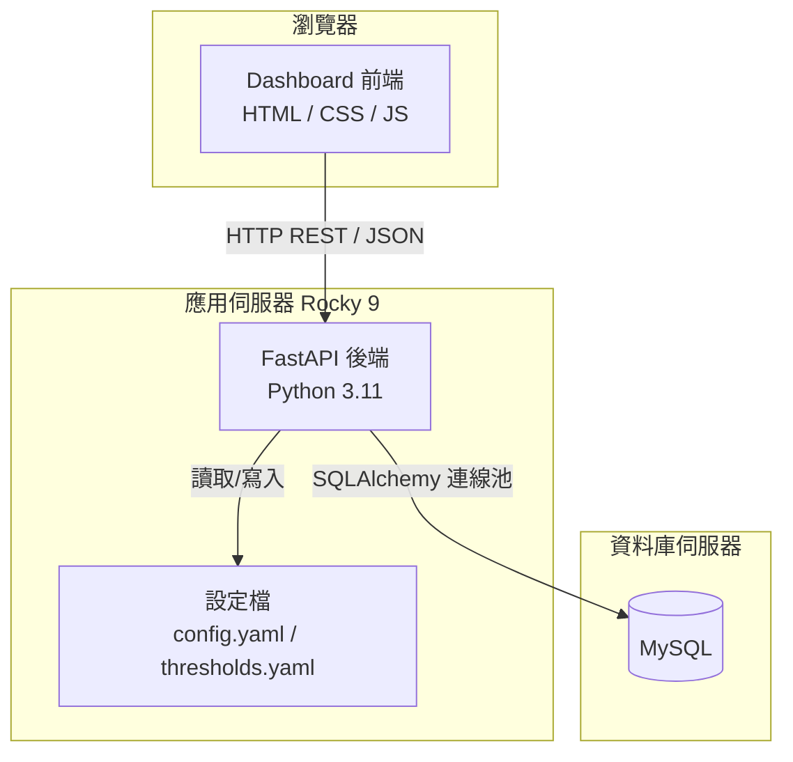

# 技術設計文件：雷達監控整合平台

## 概覽

雷達監控整合平台是一套前後端分離的網頁應用系統，部署於 Linux Rocky 9 環境。後端以 Python（FastAPI）提供 REST API，前端以純 HTML/CSS/JavaScript 實作 Dashboard，資料來源為 MySQL 資料庫。系統核心功能為即時顯示各儀器資料時間差（以顏色區分嚴重程度）與電腦系統狀態。資料異常的主動推播通知由外部系統負責，本平台僅負責視覺化呈現。

---

## 架構

### 整體架構圖



### 部署架構

- 作業系統：Linux Rocky 9
- Python 版本：3.11+
- 後端框架：FastAPI + Uvicorn（ASGI）
- 前端：靜態檔案，由 Nginx 或 FastAPI StaticFiles 提供服務
- 資料庫：MySQL 8.0+（外部既有資料庫，唯讀存取）
- 程序管理：systemd service

---

## 專案目錄結構

```
radar-monitoring-platform/
├── backend/
│   ├── main.py                  # FastAPI 應用程式進入點
│   ├── config.py                # 設定檔載入模組
│   ├── database.py              # SQLAlchemy 連線池管理
│   ├── models.py                # Pydantic 資料模型
│   ├── routers/
│   │   ├── completeness.py      # GET /api/v1/completeness/current
│   │   ├── instruments.py       # GET/PUT /api/v1/instruments/*
│   │   └── system.py            # GET /api/v1/system/current, /api/v1/disk/current
│   ├── services/
│   │   ├── alert_service.py     # 儀器時間差查詢與閾值管理
│   │   └── system_service.py    # 系統負載與磁碟狀態查詢
│   └── requirements.txt
├── frontend/
│   ├── index.html               # 首頁（導覽）
│   ├── instruments.html         # 儀器即時狀況
│   ├── computers.html           # 電腦即時狀況
│   ├── settings.html            # 儀器閾值設定
│   ├── css/
│   │   └── style.css
│   └── js/
│       ├── api.js               # 後端 API 呼叫封裝
│       ├── clock.js             # 共用時鐘
│       ├── dashboard.js         # 儀器即時狀況控制器
│       ├── computers.js         # 電腦即時狀況控制器
│       └── settings.js          # 閾值設定控制器
├── config/
│   ├── config.yaml              # 資料庫連線參數與系統設定
│   └── thresholds.yaml          # 各儀器閾值設定（持久化）
├── logs/
└── deploy/
    └── radar-monitor.service    # systemd 服務設定檔
```

---

## 元件與介面

### 後端元件

Backend 是前端與資料庫之間的橋樑，負責查詢並以 REST API 回傳結果。

- **資料存取層**：`database.py` 管理 SQLAlchemy 連線池，統一對三個 MySQL 資料庫（FileStatus、SystemStatus、DiskStatus）的唯讀存取。
- **業務邏輯層**：`services/` 封裝查詢邏輯，與路由層解耦。
- **API 層**：`routers/` 提供 `/api/v1` 前綴的 REST 端點，路由保持精簡。
- **設定層**：`config.py` 從 `config.yaml` 載入 DB 連線參數；閾值從 `thresholds.yaml` 讀寫。

#### alert_service.py

查詢所有 FileCheck 資料表，計算各儀器的 `diff_time_minutes`，並與 `thresholds.yaml` 的閾值比較。

```python
def get_all_instrument_statuses() -> list[InstrumentStatus]
def get_instrument_thresholds(file_type: str) -> tuple[float, float, float]
def set_instrument_thresholds(file_type: str, yellow: float, orange: float, red: float) -> None
def list_instruments() -> list[dict]
```

#### system_service.py

查詢 SystemStatus 和 DiskStatus 資料庫，回傳各電腦的負載、記憶體與磁碟使用率。

```python
def get_system_status() -> list[dict]
def get_disk_status() -> list[dict]
```

### 前端元件

| 頁面 | 檔案 | 說明 |
|------|------|------|
| 首頁 | `index.html` + `clock.js` | 導覽頁，三個入口 |
| 儀器即時狀況 | `instruments.html` + `dashboard.js` | 依科別分組，顏色顯示時間差 |
| 電腦即時狀況 | `computers.html` + `computers.js` | 依科別分組，負載/記憶體/磁碟 |
| 儀器閾值設定 | `settings.html` + `settings.js` | 三段閾值設定，寫回 thresholds.yaml |

---

## API 設計

### 基礎路徑：`/api/v1`

#### GET `/api/v1/completeness/current`

取得所有儀器的即時狀態。

**回應（200 OK）：**
```json
{
  "instruments": [
    {
      "file_type": "RCMD_rb5_CS",
      "equipment_name": "radar",
      "ip": "192.168.1.10",
      "department": "wrs",
      "latest_file_time": "2026-04-02T10:00:00Z",
      "diff_time_minutes": 5.2,
      "threshold_yellow": 10.0,
      "threshold_orange": 15.0,
      "threshold_red": 20.0,
      "is_alert": false
    }
  ],
  "calculated_at": "2026-04-02T10:00:05Z",
  "status": "ok"
}
```

**回應（503）：** DB 連線失敗。

---

#### GET `/api/v1/instruments`

取得所有儀器清單與目前閾值。

#### PUT `/api/v1/instruments/{file_type}/threshold`

更新特定儀器的三段閾值。

**請求本體：**
```json
{
  "threshold_yellow": 10.0,
  "threshold_orange": 15.0,
  "threshold_red": 20.0
}
```

---

#### GET `/api/v1/system/current`

取得各電腦的系統負載與記憶體使用率。

#### GET `/api/v1/disk/current`

取得各電腦的磁碟使用率（%）。

---

## 資料模型

### 現有資料庫結構（唯讀存取）

**FileStatus 資料庫**
```sql
-- 各儀器類型的即時快照（最新一筆）
radarFileCheck        (IP, FileName, FileType, FileTime float, DiffTime float)
HFradarFileCheck      (IP, FileName, FileType, FileTime float, DiffTime float)
satelliteFileCheck    (IP, FileName, FileType, FileTime float, DiffTime float)
windprofilerFileCheck (IP, FileName, FileType, FileTime float, DiffTime float)
DSFileCheck           (IP, FileName, FileType, FileTime float, DiffTime float)
-- DS 前綴代表東沙島資料，FileType 以 DS_ 開頭

-- 各儀器類型的歷史記錄
radarStatus / HFradarStatus / satelliteStatus / windprofilerStatus / DSStatus
-- (ID, IP, FileName, FileType, FileTime float, DiffTime float)

-- 檔案類型對應設備名稱
FileTypeList (ID, FileType, EquipmentName)
```

**SystemStatus 資料庫**
```sql
CheckList   (IP PK, ServerTime datetime, Load_1, Load_5, LOAD_15, MemoryUSE float)
SystemIPList (IP PK, EquipmentName, Department)
```

> **Department 代碼對照表**
>
> | Department | 中文名稱 |
> |-----------|---------|
> | `sos`  | 衛星作業科 |
> | `dqcs` | 品管科 |
> | `rsa`  | 應用科 |
> | `wrs`  | 氣象雷達科 |
> | `mrs`  | 海象雷達科 |

**DiskStatus 資料庫**
```sql
CheckList (IP, ServerTime datetime, FileSystem, Used float)
-- Used: 磁碟使用率（%）
```

### 閾值設定（thresholds.yaml）

```yaml
defaults:
  threshold_yellow: 10.0
  threshold_orange: 15.0
  threshold_red: 20.0

instruments:
  RCMD_rb5_CS:
    threshold_yellow: 10.0
    threshold_orange: 15.0
    threshold_red: 20.0
```

啟動時從檔案載入，透過 API 修改後立即寫回，重啟後保留。

### 儀器狀態顏色規則

| 條件 | 顏色 | 說明 |
|------|------|------|
| diff ≤ threshold_yellow | 綠色 | 正常 |
| diff > threshold_yellow | 黃色 | 輕微延遲 |
| diff > threshold_orange | 橙色 | 中度延遲 |
| diff > threshold_red | 紅色 | 嚴重延遲 |
| diff > 14400 或 NULL | 灰色 | 斷線 |

### Pydantic 模型

```python
class InstrumentStatus(BaseModel):
    file_type: str
    equipment_name: str
    ip: Optional[str]
    department: Optional[str]
    latest_file_time: Optional[datetime]
    diff_time_minutes: Optional[float]
    threshold_yellow: float
    threshold_orange: float
    threshold_red: float
    is_alert: bool

class InstrumentThresholdSetting(BaseModel):
    threshold_yellow: float = Field(ge=0.0)
    threshold_orange: float = Field(ge=0.0)
    threshold_red: float = Field(ge=0.0)
```

---

## 錯誤處理

| 錯誤類型 | 後端行為 | 前端顯示 |
|----------|----------|----------|
| DB 連線失敗 | 回傳 503 | 顯示「資料庫連線失敗」 |
| 查詢逾時（>5秒） | 回傳 504，記錄日誌 | 顯示「資料更新失敗，正在重試」 |
| 網路錯誤 | N/A | 顯示「資料更新失敗，正在重試」 |
| 閾值輸入負數 | 回傳 422 | 顯示驗證錯誤訊息 |
| 儀器不存在 | 回傳 404 | 顯示「找不到指定儀器」 |
| 3 次重連失敗 | 記錄 ERROR 日誌 | 顯示持續性連線失敗警示 |

---

## 測試策略

- 單元測試：`pytest` + `pytest-mock`，測試 DB 連線重試邏輯、閾值驗證
- 整合測試：`pytest` + `httpx`，測試 API 端點正常回應與錯誤情境
- 屬性測試：`hypothesis`，驗證閾值判斷邏輯的正確性
